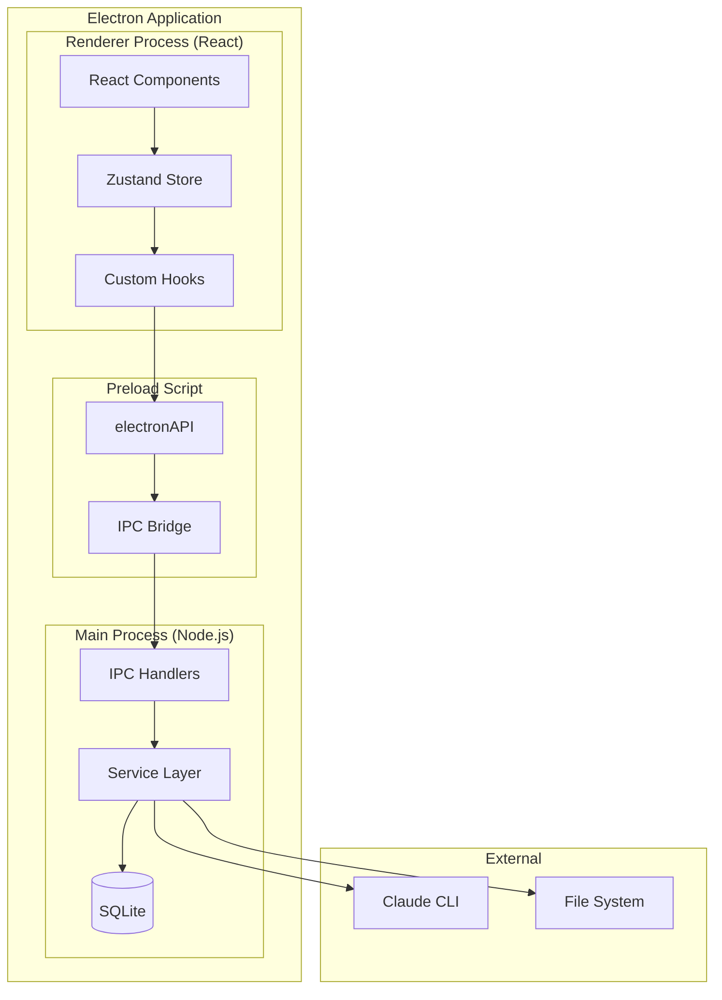
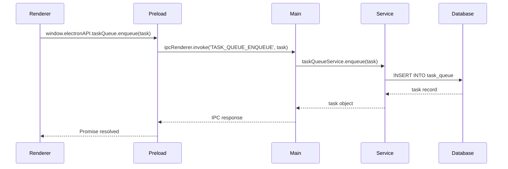
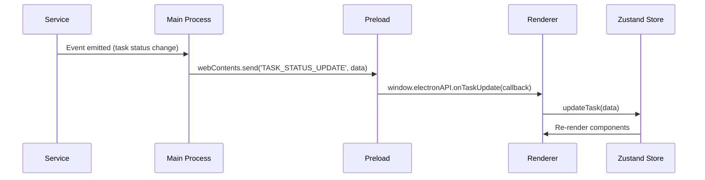
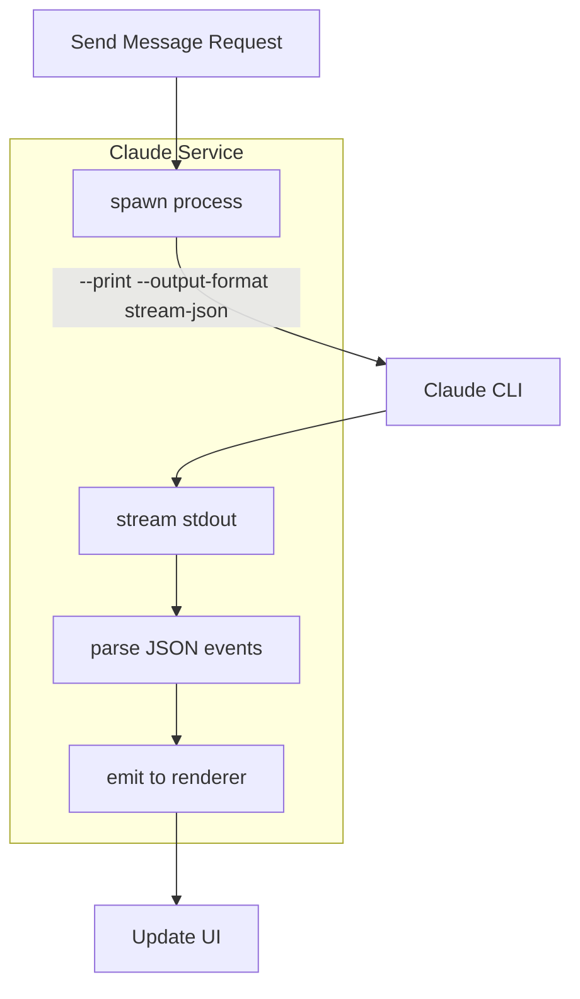
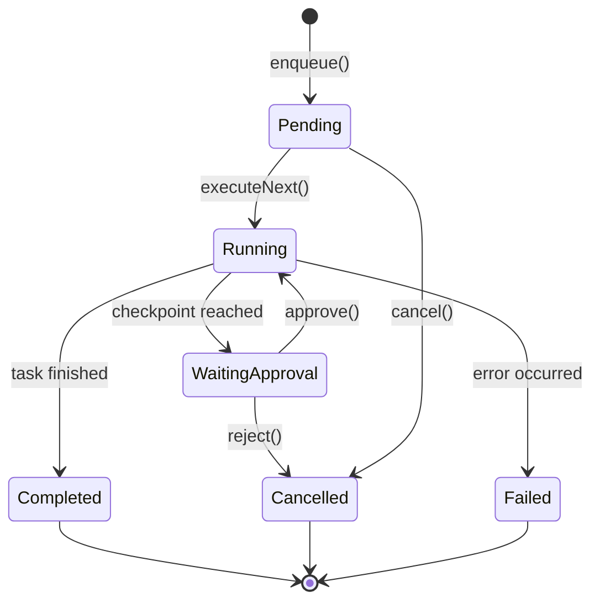
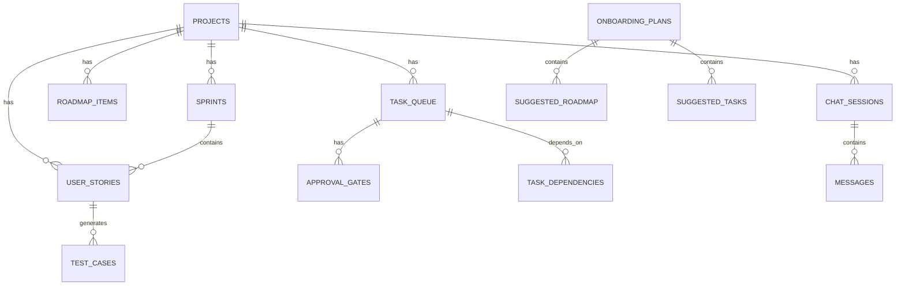
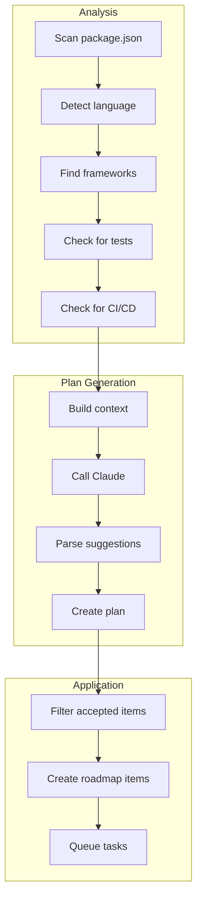
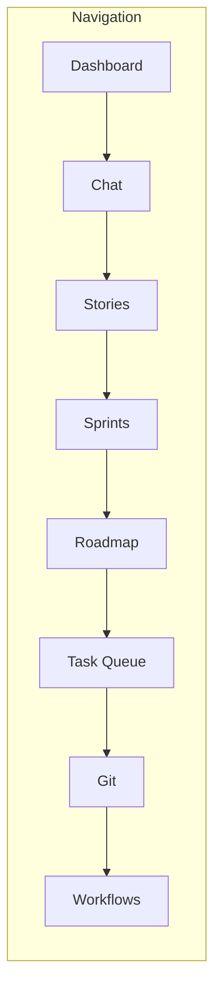
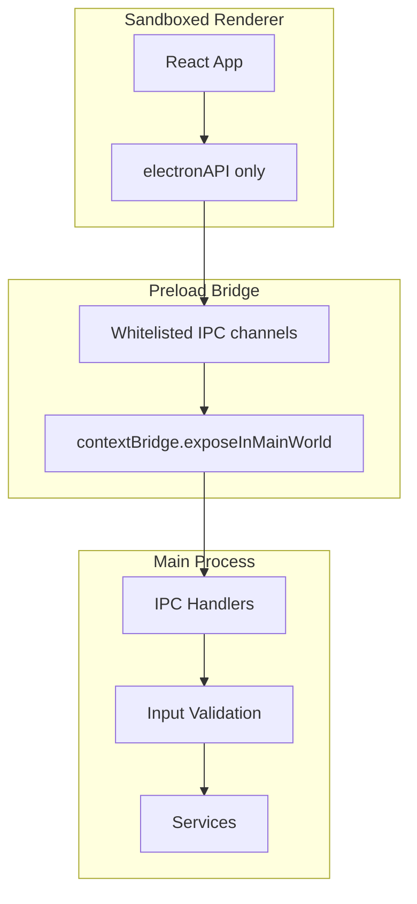
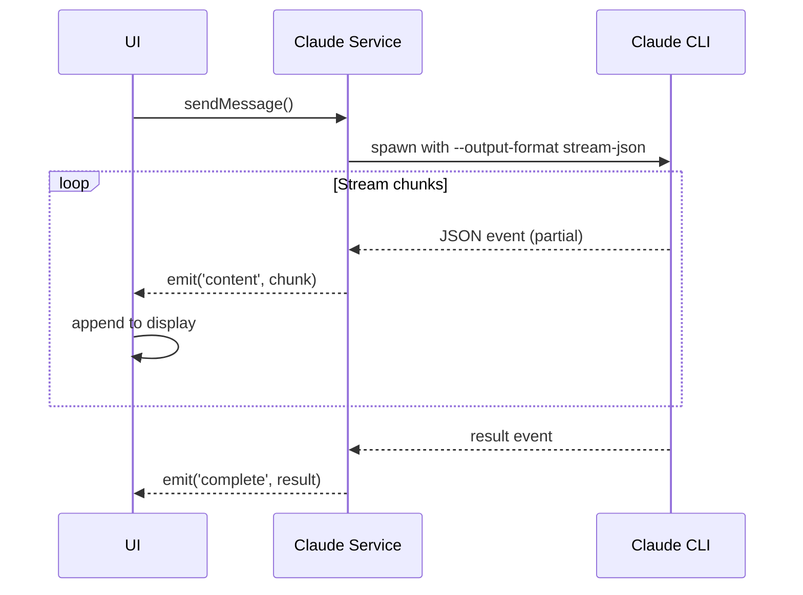

# Architecture Documentation

Technical architecture guide for Claude DevStudio.

## System Overview



## Directory Structure

```
src/
├── main/                    # Electron Main Process
│   ├── index.ts             # App entry, window management, IPC handlers
│   └── services/            # Business logic services
│       ├── claude.service.ts        # Claude CLI integration
│       ├── database.service.ts      # SQLite operations
│       ├── project.service.ts       # Project management
│       ├── task-queue.service.ts    # Task execution engine
│       ├── onboarding.service.ts    # Project analysis & setup
│       ├── workflow.service.ts      # Multi-agent workflows
│       └── ...                      # Other services
│
├── preload/                 # Preload Scripts
│   └── index.ts             # Exposes electronAPI to renderer
│
├── renderer/                # React Application
│   └── src/
│       ├── components/      # React components
│       │   ├── ChatPanel.tsx
│       │   ├── TaskQueuePanel.tsx
│       │   ├── RoadmapPanel.tsx
│       │   ├── OnboardingWizard.tsx
│       │   └── ...
│       ├── stores/          # Zustand state management
│       │   └── appStore.ts
│       ├── hooks/           # Custom React hooks
│       └── App.tsx          # Root component
│
└── shared/                  # Shared Types
    └── types/
        └── index.ts         # TypeScript interfaces, IPC channels
```

## Data Flow

### IPC Communication



### Real-time Updates



## Core Services

### Claude Service

Manages Claude CLI process spawning and streaming:



**Key Methods:**
```typescript
class ClaudeService {
  sendMessage(message: string, agentType: string, projectPath: string): EventEmitter
  checkStatus(): Promise<{ installed: boolean, authenticated: boolean, version: string }>
}
```

### Task Queue Service

Manages autonomous task execution:



**Key Methods:**
```typescript
class TaskQueueService {
  enqueue(task: TaskQueueItem): Promise<TaskQueueItem>
  list(projectId: string): TaskQueueItem[]
  executeNext(projectId: string): Promise<void>
  updateAutonomy(taskId: string, level: AutonomyLevel): void
  cancel(taskId: string): void
  approve(taskId: string): void
  reject(taskId: string, reason: string): void
}
```

### Database Service

SQLite operations with better-sqlite3:



### Onboarding Service

Project analysis and AI-powered setup:



## State Management

### Zustand Store

```typescript
interface AppState {
  // Current state
  currentProject: Project | null
  currentView: ViewMode
  projects: Project[]

  // UI state
  showTutorial: boolean
  isLoading: boolean

  // Actions
  setCurrentProject: (project: Project) => void
  setCurrentView: (view: ViewMode) => void
  addProject: (project: Project) => void
}
```

### View Modes



## Security Considerations

### Process Isolation



### Data Storage

- **User data**: `~/Library/Application Support/claude-devstudio/`
- **Database**: SQLite with prepared statements (SQL injection safe)
- **No remote storage**: All data stays local

## Performance Optimizations

### Lazy Loading

```typescript
// Services loaded on demand
const taskQueueService = await import('./task-queue.service')
```

### Database Indexing

```sql
CREATE INDEX idx_task_queue_project ON task_queue(project_id);
CREATE INDEX idx_task_queue_status ON task_queue(status);
CREATE INDEX idx_task_queue_priority ON task_queue(priority);
```

### Streaming Responses



## Testing Strategy

### Unit Tests (Vitest)

```
src/main/services/*.test.ts     # Service tests
src/renderer/src/**/*.test.tsx  # Component tests
```

### E2E Tests (Playwright)

```
e2e/
├── electron.setup.ts           # Electron test setup
├── full-flow.spec.ts           # Complete user journey
└── todo-app-demo.spec.ts       # Autonomous flow demo
```

### Running Tests

```bash
# Unit tests with coverage
npm run test:coverage

# E2E tests
npm run test

# E2E with UI
npm run test:ui
```

## Extending the Application

### Adding a New Service

1. Create service file: `src/main/services/my.service.ts`
2. Add IPC channel in `src/shared/types/index.ts`
3. Register handler in `src/main/index.ts`
4. Expose in preload: `src/preload/index.ts`

### Adding a New View

1. Create component: `src/renderer/src/components/MyPanel.tsx`
2. Add to ViewMode type in `src/shared/types/index.ts`
3. Add keyboard shortcut in `useKeyboardShortcuts.ts`
4. Add sidebar button in `Sidebar.tsx`

### Adding a New Agent Type

1. Define system prompt in `src/main/services/claude.service.ts`
2. Add agent type to `AgentType` enum
3. Update UI agent selector

---

## Related Documentation

- [User Guide](USER_GUIDE.md) - End-user documentation
- [Quick Start](QUICK_START.md) - Getting started guide
- [CLAUDE.md](../CLAUDE.md) - Development guidelines
