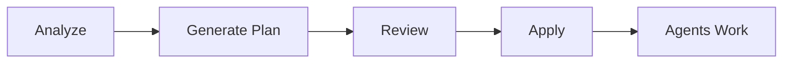

# Quick Start Guide

Get started with Claude DevStudio in 5 minutes.

## Prerequisites

```bash
# Ensure Claude Code CLI is installed
claude --version
# Should show: 2.x.x (Claude Code)
```

## Step 1: Launch the App

```bash
npm run dev
```

You'll see the Welcome Screen:


## Step 2: Create or Open a Project

### Option A: Open Existing Project
Click **Open Project** and select your project folder.

### Option B: Create New Project
1. Click **New Project**
2. Enter project name
3. Select parent folder

## Step 3: Automatic Project Setup

The AI will analyze your project and create a plan:



### Analysis Phase
The system detects:
- Language & frameworks
- Project structure
- Missing components (tests, CI/CD, docs)


### Plan Generation
AI creates:
- **Roadmap items** in Now/Next/Later lanes
- **Tasks** with assigned agents and autonomy levels


### Apply Plan
Click **Apply Plan** to:
- Create roadmap items in database
- Queue tasks for agents
- Start autonomous execution


## Step 4: Work with AI Agents

### Chat View (Cmd/Ctrl + 2)
Talk directly with any agent:

```
You: Create a user authentication module with bcrypt

Developer Agent: I'll create the authentication module...
[Shows code and implementation details]
```

### Task Queue (Cmd/Ctrl + 6)
View and manage autonomous tasks:


**Autonomy Levels:**
| Level | Icon | Behavior |
|-------|------|----------|
| Auto | 🟢 | Runs without stopping |
| Approval Gates | 🟡 | Pauses for review at checkpoints |
| Supervised | 🔴 | Requires approval before AND after |

### Roadmap (Cmd/Ctrl + 5)
Prioritize work in lanes:


## Step 5: Review Results


## Quick Reference

### Keyboard Shortcuts

| Keys | Action |
|------|--------|
| `Cmd/Ctrl + 1` | Dashboard |
| `Cmd/Ctrl + 2` | Chat |
| `Cmd/Ctrl + 3` | Stories |
| `Cmd/Ctrl + 4` | Sprints |
| `Cmd/Ctrl + 5` | Roadmap |
| `Cmd/Ctrl + 6` | Task Queue |
| `Cmd/Ctrl + 7` | Git |
| `Cmd/Ctrl + 8` | Workflows |
| `Cmd/Ctrl + K` | Command Palette |
| `?` | Tutorial |

### Agent Types

| Agent | Use For |
|-------|---------|
| **Developer** | Code, refactoring, debugging |
| **Product Owner** | User stories, requirements |
| **Tester** | Test cases, QA |
| **Security** | Audits, vulnerability scans |
| **DevOps** | CI/CD, deployment |
| **Documentation** | Docs, README, API docs |

## Next Steps

1. **Read the full [User Guide](USER_GUIDE.md)** for detailed features
2. **Try built-in workflows** in the Workflows view
3. **Customize autonomy levels** based on your trust/verification needs

---

*Need help? Press `?` for the in-app tutorial or check the [User Guide](USER_GUIDE.md)*
