# Claude DevStudio User Guide

> AI-Powered Agile SDLC Desktop Application

## Table of Contents

1. [Introduction](#introduction)
2. [Getting Started](#getting-started)
3. [Core Concepts](#core-concepts)
4. [Views & Features](#views--features)
5. [Workflows](#workflows)
6. [Keyboard Shortcuts](#keyboard-shortcuts)
7. [Best Practices](#best-practices)

---

## Introduction

Claude DevStudio is a desktop application that integrates AI agents into your software development lifecycle. It uses Claude Code CLI to provide specialized AI personas that can help with development, testing, security, documentation, and more.

### Key Features

- **6 AI Agent Personas** - Specialized agents for different tasks
- **Autonomous Task Execution** - AI works independently with configurable oversight
- **Project Analysis** - Automatic project structure detection
- **Roadmap Planning** - Now/Next/Later prioritization
- **Sprint Management** - Kanban-style task boards
- **Multi-Agent Workflows** - Chain agents for complex tasks

### Architecture Overview

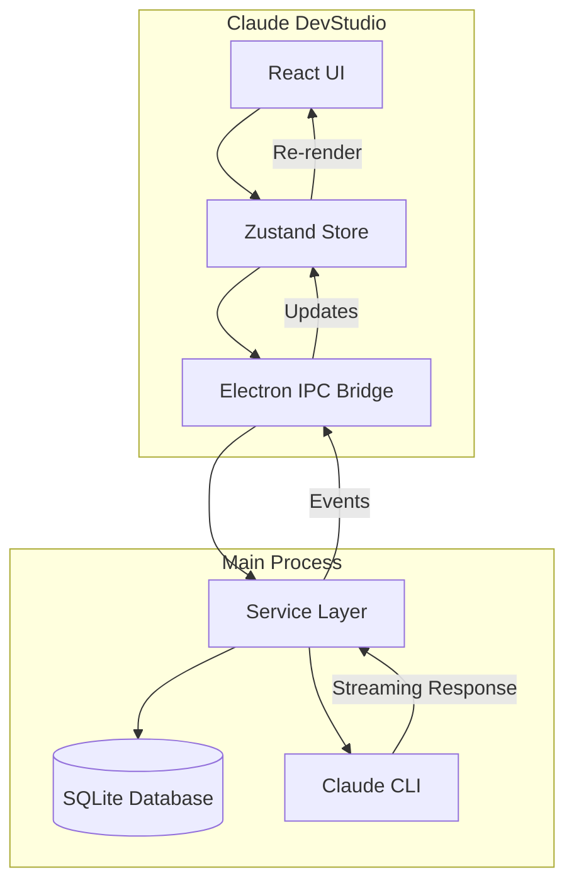

---

## Getting Started

### Prerequisites

1. **Claude Code CLI** - Must be installed and authenticated
   ```bash
   # Verify installation
   claude --version
   ```

2. **Node.js** - Version 18 or higher

### Installation

```bash
# Clone the repository
git clone https://github.com/your-org/claude-devstudio.git

# Install dependencies
npm install

# Start development mode
npm run dev

# Or build for production
npm run build:mac   # macOS
npm run build:win   # Windows
npm run build:linux # Linux
```

### First Launch

When you first launch Claude DevStudio, you'll see the Welcome Screen:


From here you can:
- **Open Project** - Select an existing folder
- **New Project** - Create a new project folder

---

## Core Concepts

### AI Agents

Claude DevStudio provides 6 specialized AI agents:

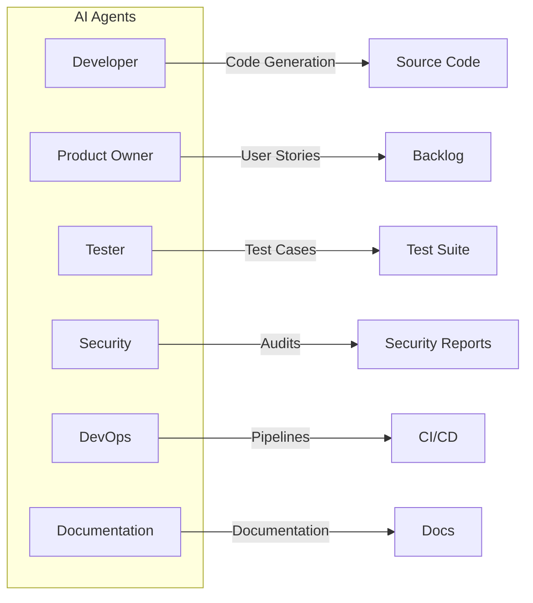

| Agent | Responsibilities |
|-------|-----------------|
| **Developer** | Code generation, refactoring, debugging, code review |
| **Product Owner** | User stories, acceptance criteria, backlog prioritization |
| **Tester** | Test cases, test plans, QA automation |
| **Security** | Security audits, vulnerability scanning, compliance |
| **DevOps** | CI/CD pipelines, deployment, infrastructure |
| **Documentation** | Technical docs, API docs, user guides |

### Autonomy Levels

Control how much oversight AI agents have:

```mermaid
stateDiagram-v2
    [*] --> Pending

    state "Auto Mode" as Auto {
        Pending --> Executing: Start immediately
        Executing --> Completed: Finish without stops
    }

    state "Approval Gates Mode" as Gates {
        Pending --> Executing: Start immediately
        Executing --> ReviewOutput: Checkpoint reached
        ReviewOutput --> Executing: Approved
        ReviewOutput --> Completed: Final approval
    }

    state "Supervised Mode" as Supervised {
        Pending --> WaitingApproval: Request to start
        WaitingApproval --> Executing: User approves
        Executing --> ReviewOutput: Task complete
        ReviewOutput --> Completed: User confirms
    }
```

| Level | Description | Use Case |
|-------|-------------|----------|
| **Auto** | Execute without stopping | Documentation, formatting, simple tasks |
| **Approval Gates** | Pause at checkpoints | Code generation, refactoring |
| **Supervised** | Require approval before AND after | Deployments, security changes, deletions |

### Task Queue

The task queue manages all agent tasks:

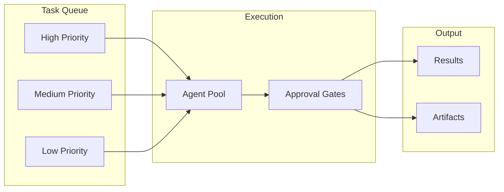

---

## Views & Features

### 1. Dashboard (Cmd/Ctrl + 1)

The dashboard provides an overview of your project:

- Project metrics and statistics
- Recent activity
- Sprint progress
- Quick actions

### 2. Chat (Cmd/Ctrl + 2)

Interactive conversation with AI agents:

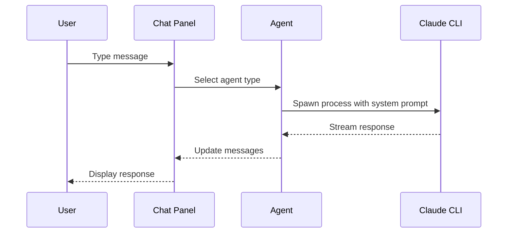

**Features:**
- Select agent type (Developer, Tester, etc.)
- View conversation history
- Context-aware responses
- Code highlighting

### 3. Stories (Cmd/Ctrl + 3)

User story management:

```
┌─────────────────────────────────────────────────────────┐
│  USER STORIES                                           │
├─────────────────────────────────────────────────────────┤
│                                                         │
│  ┌─────────────────────────────────────────────────┐   │
│  │ [HIGH] User Authentication                       │   │
│  │                                                  │   │
│  │ As a user, I want to log in securely            │   │
│  │ so that my data is protected.                   │   │
│  │                                                  │   │
│  │ Story Points: 5  │  Status: In Progress         │   │
│  └─────────────────────────────────────────────────┘   │
│                                                         │
│  ┌─────────────────────────────────────────────────┐   │
│  │ [MEDIUM] Dashboard View                          │   │
│  │                                                  │   │
│  │ As a user, I want to see my dashboard           │   │
│  │ so that I can monitor activity.                 │   │
│  │                                                  │   │
│  │ Story Points: 3  │  Status: Backlog             │   │
│  └─────────────────────────────────────────────────┘   │
│                                                         │
└─────────────────────────────────────────────────────────┘
```

**Features:**
- Create user stories with acceptance criteria
- Assign story points
- Priority levels (High, Medium, Low)
- Link to sprints

### 4. Sprints (Cmd/Ctrl + 4)

Kanban-style sprint board:

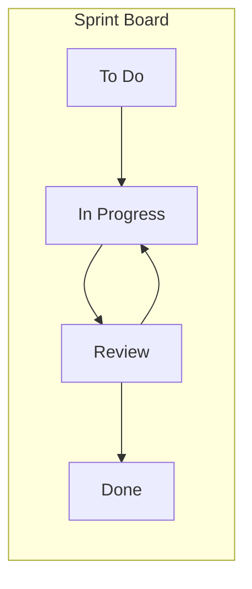

**Features:**
- Drag-and-drop task management
- Sprint goals and dates
- Velocity tracking
- Burndown visualization

### 5. Roadmap (Cmd/Ctrl + 5)

Now/Next/Later prioritization:

```
┌─────────────────────────────────────────────────────────────────────┐
│  ROADMAP                                                            │
├───────────────────┬───────────────────┬───────────────────────────┤
│       NOW         │       NEXT        │         LATER             │
│   (Current Focus) │    (Upcoming)     │        (Future)           │
├───────────────────┼───────────────────┼───────────────────────────┤
│                   │                   │                           │
│ ┌───────────────┐ │ ┌───────────────┐ │ ┌───────────────────────┐ │
│ │ Setup Dev Env │ │ │ CI/CD Pipeline│ │ │ Mobile App Support    │ │
│ │ [HIGH]        │ │ │ [MEDIUM]      │ │ │ [LOW]                 │ │
│ └───────────────┘ │ └───────────────┘ │ └───────────────────────┘ │
│                   │                   │                           │
│ ┌───────────────┐ │ ┌───────────────┐ │ ┌───────────────────────┐ │
│ │ Code Quality  │ │ │ API Docs      │ │ │ Analytics Dashboard   │ │
│ │ [HIGH]        │ │ │ [MEDIUM]      │ │ │ [LOW]                 │ │
│ └───────────────┘ │ └───────────────┘ │ └───────────────────────┘ │
│                   │                   │                           │
└───────────────────┴───────────────────┴───────────────────────────┘
```

**Features:**
- Drag items between lanes
- Epic/Feature/Milestone types
- Target quarters
- Progress tracking

### 6. Task Queue (Cmd/Ctrl + 6)

Autonomous task execution:

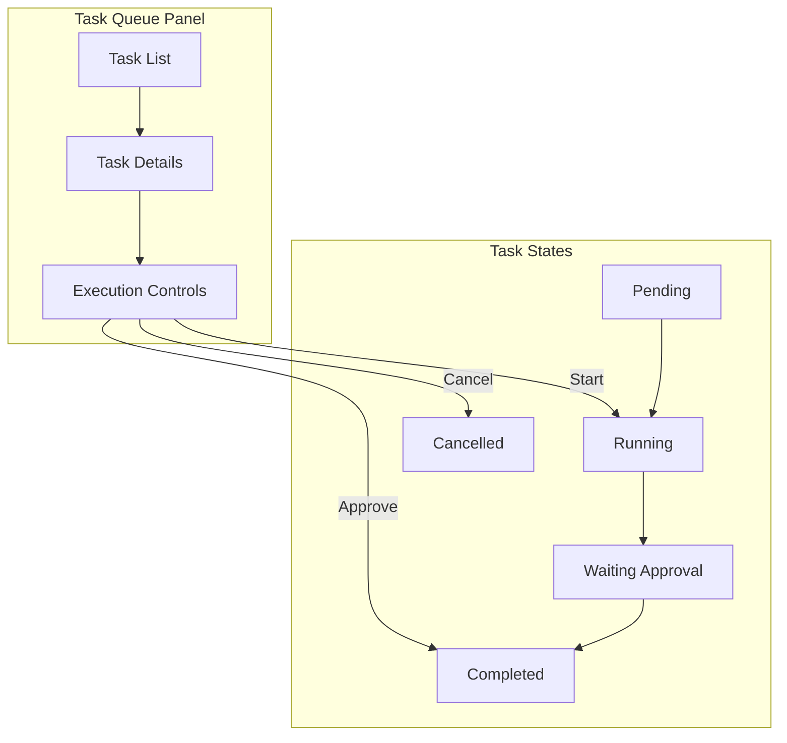

**Features:**
- View all queued tasks
- Change autonomy levels
- Approve/reject at gates
- View task output and artifacts

### 7. Git (Cmd/Ctrl + 7)

Repository management:

**Features:**
- View changed files
- Commit history
- Branch management
- Diff viewer

### 8. Workflows (Cmd/Ctrl + 8)

Multi-agent pipelines:

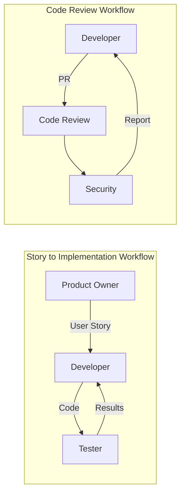

**Built-in Templates:**
- Story to Tests
- Story to Implementation
- Code Review + Security
- Full Feature Pipeline

---

## Workflows

### Project Onboarding Flow

When you create or open a new project, the onboarding wizard guides you through setup:

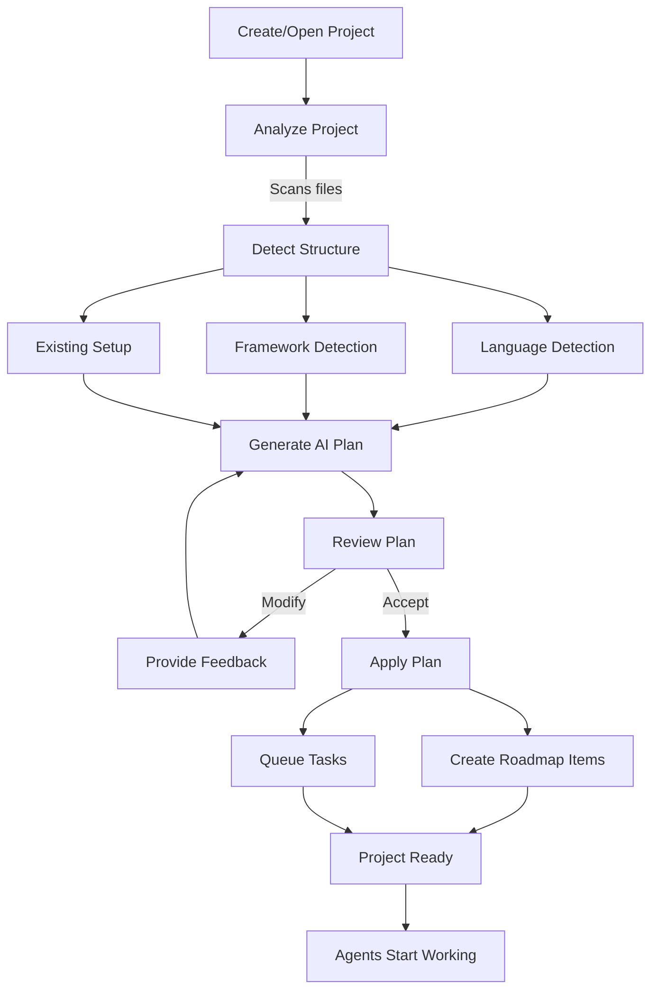

**Step 1: Project Analysis**

The system automatically detects:
- Programming language (TypeScript, Python, Go, etc.)
- Frameworks (React, Express, Django, etc.)
- Existing tests, CI/CD, Docker setup
- Project structure and entry points

**Step 2: AI Plan Generation**

Claude generates a customized plan with:
- Roadmap items in Now/Next/Later lanes
- Tasks assigned to appropriate agents
- Suggested autonomy levels

**Step 3: Review & Apply**

You can:
- Select/deselect items
- Provide feedback to refine the plan
- Apply when satisfied

### Task Execution Flow

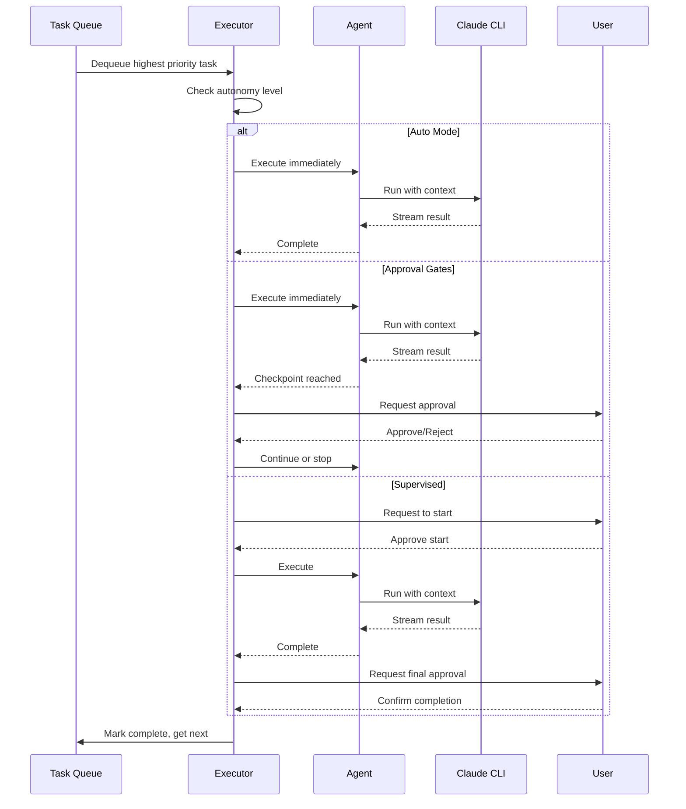

### Multi-Agent Workflow

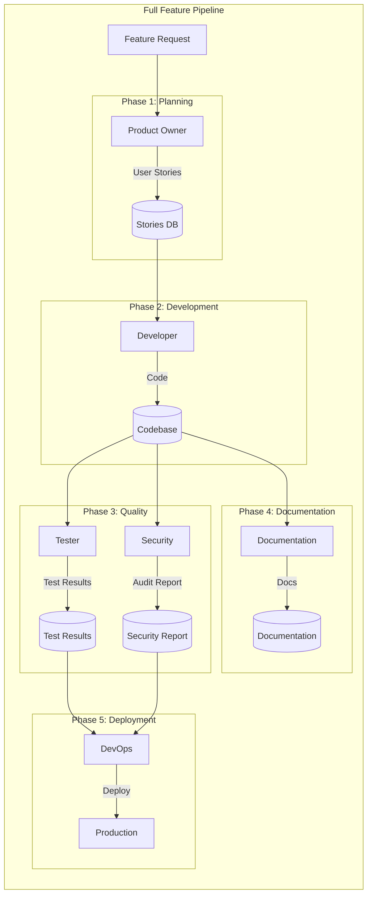

---

## Keyboard Shortcuts

### Navigation

| Shortcut | Action |
|----------|--------|
| `Cmd/Ctrl + 1` | Dashboard |
| `Cmd/Ctrl + 2` | Chat |
| `Cmd/Ctrl + 3` | Stories |
| `Cmd/Ctrl + 4` | Sprints |
| `Cmd/Ctrl + 5` | Roadmap |
| `Cmd/Ctrl + 6` | Task Queue |
| `Cmd/Ctrl + 7` | Git |
| `Cmd/Ctrl + 8` | Workflows |

### Actions

| Shortcut | Action |
|----------|--------|
| `Cmd/Ctrl + K` | Command Palette |
| `Cmd/Ctrl + N` | New Item (context-aware) |
| `Cmd/Ctrl + S` | Save |
| `Cmd/Ctrl + Enter` | Send message (in Chat) |
| `?` | Show Tutorial |
| `Esc` | Close modal/dialog |

### Chat

| Shortcut | Action |
|----------|--------|
| `Cmd/Ctrl + Enter` | Send message |
| `Shift + Enter` | New line in message |
| `Up Arrow` | Edit last message |

---

## Best Practices

### 1. Start with Analysis

Always let the onboarding wizard analyze your project first. This ensures:
- Correct agent recommendations
- Appropriate task suggestions
- Proper context for AI responses

### 2. Use Appropriate Autonomy Levels

```
┌─────────────────────────────────────────────────────────────────┐
│  AUTONOMY LEVEL GUIDE                                           │
├─────────────────────────────────────────────────────────────────┤
│                                                                 │
│  AUTO (Green)                                                   │
│  ├── Documentation generation                                   │
│  ├── Code formatting                                            │
│  ├── Simple refactoring                                         │
│  └── Test scaffolding                                           │
│                                                                 │
│  APPROVAL GATES (Yellow)                                        │
│  ├── Code generation                                            │
│  ├── Complex refactoring                                        │
│  ├── Database migrations                                        │
│  └── API changes                                                │
│                                                                 │
│  SUPERVISED (Red)                                               │
│  ├── Production deployments                                     │
│  ├── Security-sensitive changes                                 │
│  ├── Data deletions                                             │
│  └── Infrastructure changes                                     │
│                                                                 │
└─────────────────────────────────────────────────────────────────┘
```

### 3. Provide Context in Chat

When chatting with agents, provide:
- Clear requirements
- Relevant file paths
- Expected outcomes
- Constraints or preferences

**Good:**
```
Create a user authentication module using bcrypt for password
hashing. The module should:
- Support email/password login
- Use JWT tokens with 24h expiry
- Follow the existing patterns in src/auth/
```

**Bad:**
```
Add login
```

### 4. Review AI Output

Even with auto mode:
- Review generated code before committing
- Run tests after code changes
- Check security reports for false positives

### 5. Use Workflows for Complex Tasks

Instead of running agents individually:
- Use built-in workflow templates
- Create custom workflows for repeated tasks
- Let agents pass context to each other

### 6. Keep Roadmap Updated

- Move completed items out of "Now"
- Regularly review "Next" priorities
- Archive old "Later" items

---

## Troubleshooting

### Claude CLI Not Found

```bash
# Check if Claude is installed
which claude

# If not found, install Claude Code CLI
# Follow instructions at: https://claude.ai/code
```

### Database Errors

If you see database schema errors:
1. Close the application
2. Delete `~/Library/Application Support/claude-devstudio/claude-data/`
3. Restart the application

### Task Stuck in Queue

If a task won't complete:
1. Check the task's autonomy level
2. Look for pending approval requests
3. Cancel and re-queue if necessary

### Agent Not Responding

If chat messages aren't getting responses:
1. Check Claude CLI authentication: `claude auth status`
2. Verify internet connection
3. Check for rate limiting

---

## Appendix

### Database Schema

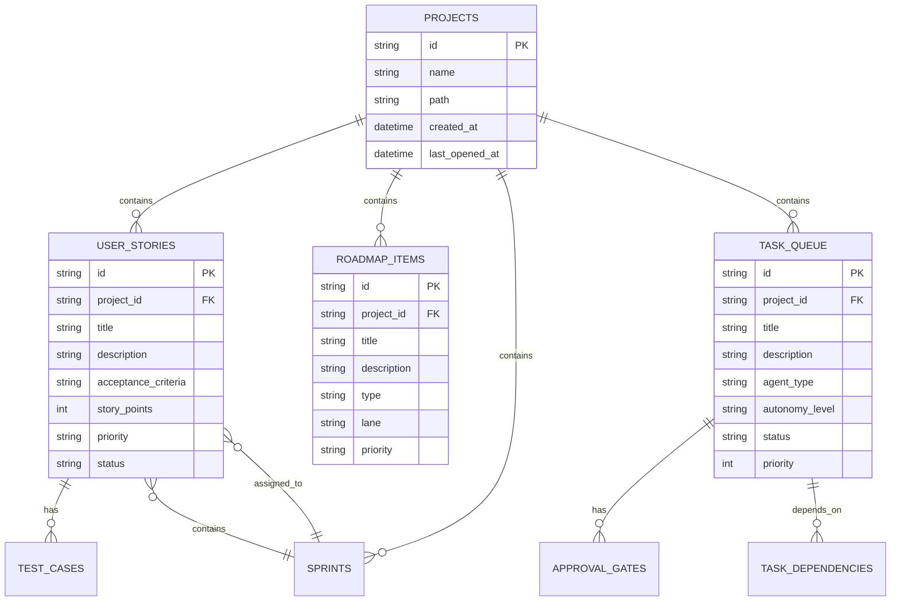

### API Reference

All IPC channels are defined in `src/shared/types/index.ts`:

```typescript
// Project operations
window.electronAPI.projects.create({ path, name })
window.electronAPI.projects.open(projectId)
window.electronAPI.projects.list()

// Task Queue operations
window.electronAPI.taskQueue.enqueue({ ... })
window.electronAPI.taskQueue.list(projectId)
window.electronAPI.taskQueue.updateAutonomy(taskId, level)
window.electronAPI.taskQueue.cancel(taskId)

// Onboarding operations
window.electronAPI.onboarding.analyze(projectPath)
window.electronAPI.onboarding.init({ projectPath, projectName, projectId })
window.electronAPI.onboarding.applyPlan(planId)

// And more...
```

---

## Support

- **GitHub Issues**: Report bugs and request features
- **Documentation**: Check `CLAUDE.md` for developer documentation
- **Community**: Join discussions in GitHub Discussions

---

*Claude DevStudio - Empowering developers with AI-assisted Agile workflows*
